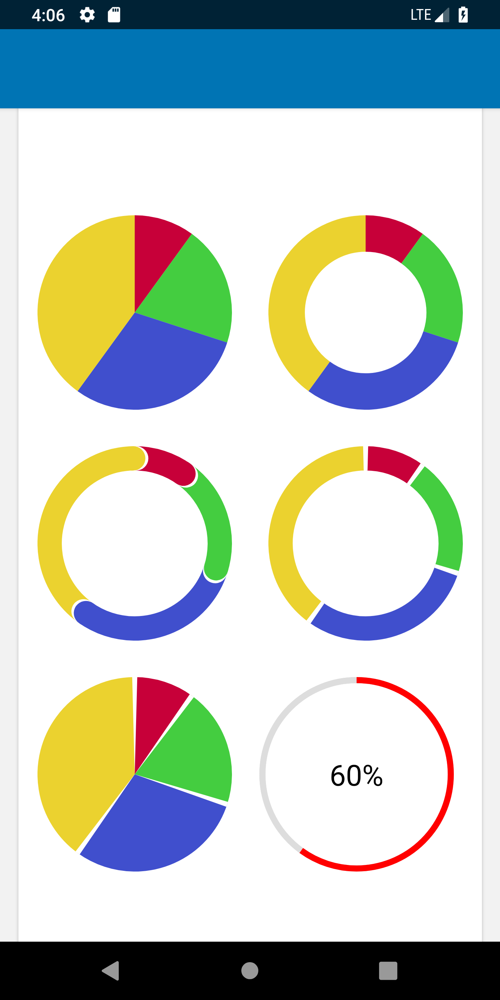

# react-native-pie

Pie chart for React Native, works on **iOS** and **Android** both

## Demo




## Install

1. `npm i --save react-native-pie`  
2. Link the ART library to your ReactNative project ([how to link a library](https://facebook.github.io/react-native/docs/linking-libraries-ios.html#content)). You'll find the React ART library in `node_modules/react-native/Libraries/ART/ART.xcodeproj`

## Usage

```jsx
import React, { Component } from 'react'
import {
  StyleSheet,
  View,
  Text,
} from 'react-native'
import Pie from 'react-native-pie'

export default class PieDemo extends Component {
  render() {
    return (
      <View style={styles.container}>
        <Pie
          radius={100}
          series={[10, 20, 30, 40]}
          colors={['red', 'lime', 'blue', 'yellow']} />
        <Pie
          radius={100}
          innerRadius={60}
          series={[10, 20, 30, 40]}
          colors={['#f00', '#0f0', '#00f', '#ff0']} />
        <View>
          <Pie
            radius={50}
            innerRadius={45}
            series={[60]}
            colors={['#f00']}
            backgroundColor='#ddd' />
          <View style={styles.gauge}>
            <Text style={styles.gaugeText}>60%</Text>
          </View>
        </View>
      </View>
    )
  }
}

const styles = StyleSheet.create({
  container: {
    flex: 1,
    alignItems: 'center',
    justifyContent: 'space-around',
  },
  gauge: {
    position: 'absolute',
    width: 100,
    height: 100,
    alignItems: 'center',
    justifyContent: 'center',
  },
  gaugeText: {
    backgroundColor: 'transparent',
    color: '#000',
    fontSize: 24,
  },
})
```

## Props

* **series** percentage array, required
* **colors** pie color array, required
* **radius** `radius = size / 2`, required
* **innerRadius** default to `0`
* **backgroundColor** default to `#fff`

## License

MIT
